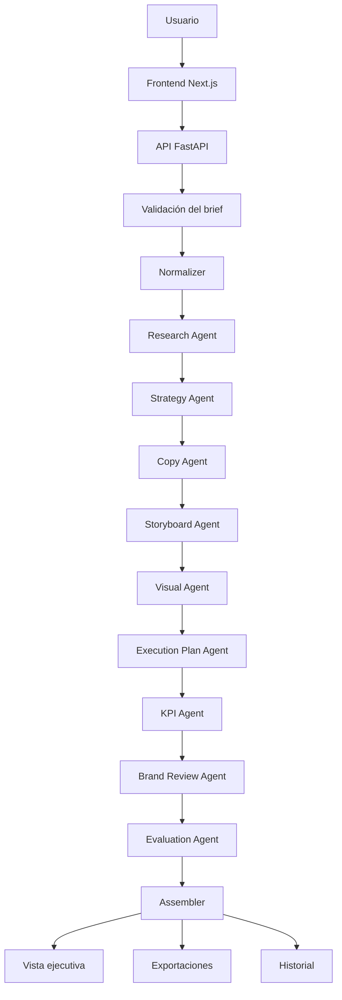

# Multimedia AgentOps Studio

Plataforma full-stack para generar campañas multimedia a partir de briefs creativos mediante un flujo de agentes de inteligencia artificial especializados.


## Demo local

- **Frontend:** `http://localhost:3000`
- **Backend:** `http://localhost:8000`
- **Health check:** `http://localhost:8000/health`

## Sobre el proyecto

**Multimedia AgentOps Studio** es una aplicación tipo SaaS que convierte un brief de marca en una campaña multimedia completa.

El usuario ingresa información como marca, tono, audiencia, voz, restricciones y canales. A partir de eso, el backend ejecuta un flujo de agentes especializados que generan investigación, estrategia, copy, storyboard, dirección visual, plan de ejecución, KPIs, revisión de marca y evaluación final.

La intención del proyecto no es resolver todo con un único prompt, sino construir un sistema organizado donde cada agente tenga una responsabilidad clara y donde el resultado final sea útil, revisable y exportable.

## Objetivo

El objetivo principal es demostrar cómo la inteligencia artificial puede integrarse dentro de un flujo creativo completo, con una interfaz clara, trazabilidad del proceso y entregables listos para revisar.

El proyecto aborda varios problemas comunes en la generación de campañas con IA:

- respuestas demasiado generales;
- falta de separación entre estrategia, copy y dirección visual;
- dificultad para revisar qué produjo cada etapa;
- poca trazabilidad del proceso;
- problemas con JSON inválido o respuestas truncadas del proveedor LLM;
- consumo elevado de tokens cuando el flujo no está optimizado;
- falta de exportaciones útiles para compartir resultados.

Para resolverlo, el sistema combina una interfaz web, un backend en FastAPI, agentes especializados, validación de entradas, manejo de errores del proveedor, historial de campañas y exportación en varios formatos.

## Qué hace

Cada campaña sigue este flujo:

1. El usuario escribe un brief de marca.
2. El sistema normaliza la información recibida.
3. Se ejecuta un agente de investigación.
4. Se genera un sistema estratégico de campaña.
5. Se crean piezas de copy multicanal.
6. Se produce un storyboard para video corto.
7. Se define una dirección visual.
8. Se arma un plan operativo por semanas.
9. Se definen KPIs y eventos de medición.
10. Se revisa la coherencia de marca, tono y riesgos.
11. Se evalúa la campaña con métricas de calidad.
12. Se ensambla una vista ejecutiva final.
13. La campaña puede guardarse, consultarse desde el historial y exportarse.

## Caso de uso

El caso principal es la generación de campañas multimedia para marcas, productos digitales, startups, agencias creativas o proyectos personales.

Una campaña generada puede incluir:

- resumen ejecutivo;
- insights de audiencia;
- propuesta estratégica;
- hooks y CTAs;
- copies para redes, landing y email;
- storyboard con escenas y tiempos;
- guía visual;
- plan de ejecución de 4 semanas;
- KPIs de awareness, engagement, conversión y retención;
- revisión de marca;
- score final de calidad;
- recomendaciones accionables.

## Arquitectura



## Agentes del sistema

### 1. Normalizer

Organiza el brief recibido y prepara una estructura común para los demás agentes.

Trabaja con:

- marca;
- tono;
- audiencia;
- voz;
- restricciones;
- canales;
- objetivo general de campaña.

### 2. Research Agent

Convierte el brief en hallazgos útiles para la campaña.

Entrega:

- tensiones de la audiencia;
- oportunidades de posicionamiento;
- contexto de mercado;
- posibles ángulos creativos;
- señales para diferenciar la marca.

### 3. Strategy Agent

Define el sistema estratégico de la campaña.

Entrega:

- posicionamiento;
- promesa principal;
- mensaje central;
- pilares de campaña;
- enfoque por canal;
- lógica de conversión.

### 4. Copy Agent

Genera textos listos para adaptar o usar.

Entrega:

- hooks;
- captions;
- CTAs;
- titulares para landing;
- asuntos de email;
- mensajes para redes sociales.

### 5. Storyboard Agent

Convierte la campaña en una propuesta audiovisual.

Entrega:

- estructura de video corto;
- escenas con duración;
- acción visual;
- texto en pantalla;
- ritmo narrativo;
- cierre y llamada a la acción.

### 6. Visual Agent

Define la dirección visual de la campaña.

Entrega:

- concepto visual;
- paleta sugerida;
- estilo de composición;
- referencias de ambiente;
- prompts visuales;
- lineamientos para mantener consistencia.

### 7. Execution Plan Agent

Organiza la campaña en un plan de implementación.

Entrega:

- fases por semana;
- tareas principales;
- piezas a producir;
- orden recomendado;
- entregables por etapa.

### 8. KPI Agent

Define cómo medir el desempeño de la campaña.

Entrega:

- métrica principal;
- KPIs por etapa;
- eventos de tracking;
- metas iniciales;
- preguntas de aprendizaje.

### 9. Brand Review Agent

Revisa consistencia, tono y riesgos.

Entrega:

- alertas de marca;
- riesgos de comunicación;
- puntos a ajustar;
- recomendaciones para mantener coherencia.

### 10. Evaluation Agent

Evalúa la campaña generada.

Entrega una puntuación basada en:

- claridad;
- ajuste a marca;
- adecuación por canal;
- profundidad creativa;
- facilidad de ejecución;
- control de riesgo.

### 11. Assembler

Reúne todas las salidas en una campaña final más fácil de leer y exportar.

## Interfaz

La aplicación incluye:

- formulario guiado para crear campañas;
- ejemplos rápidos para probar el sistema;
- estado del proveedor LLM;
- timeline compacto del flujo de agentes;
- resumen ejecutivo;
- entregables por agente;
- evaluación de calidad;
- historial de campañas;
- renombrado, fijado y eliminación de campañas guardadas;
- exportación en ZIP, PDF, Markdown y JSON.

## Stack

### Frontend

- **Next.js**
- **React**
- **TypeScript**
- **Tailwind CSS**

### Backend

- **FastAPI**
- **Python**
- **SQLAlchemy**
- **SQLite**

### Inteligencia artificial

- **Groq API**
- modelo configurable mediante variables de entorno;
- modo mock para desarrollo y demos sin consumo de tokens.

### Exportación

- **ReportLab** para PDF;
- **Markdown** para documentos editables;
- **JSON** para salida estructurada;
- **ZIP** para paquetes completos de campaña.

## Estructura del proyecto

```text
multimedia-agentops-studio/
├── .github/
│   └── workflows/
│       └── ci.yml
├── apps/
│   ├── api/
│   │   ├── app/
│   │   ├── tests/
│   │   ├── .env.example
│   │   ├── pyproject.toml
│   │   └── requirements.txt
│   └── web/
│       ├── app/
│       ├── components/
│       ├── hooks/
│       ├── lib/
│       ├── public/
│       ├── .env.example
│       └── package.json
├── docs/
├── packages/
│   └── shared/
├── docker-compose.yml
├── LICENSE
├── Makefile
├── package.json
├── README.md
└── .gitignore
```

## Instalación local

### Requisitos

- Node.js 20 o superior.
- Python 3.11 o superior.
- Una API key de Groq si quieres usar generación real.
- Windows PowerShell, terminal de Cursor o terminal equivalente.

## Configurar backend

Entra al backend:

```powershell
cd apps\api
```

Crea y activa el entorno virtual:

```powershell
python -m venv .venv
.venv\Scripts\activate
```

Si PowerShell bloquea la activación:

```powershell
Set-ExecutionPolicy -Scope CurrentUser RemoteSigned
.venv\Scripts\activate
```

Instala dependencias:

```powershell
pip install -r requirements.txt
```

Copia el archivo de entorno:

```powershell
copy .env.example .env
```

Configura `apps/api/.env`:

```env
LLM_PROVIDER=groq
GROQ_API_KEY=your_groq_key_here
GROQ_MODEL=llama-3.1-8b-instant
MOCK_MODE=false
DATABASE_URL=sqlite:///./agentops.db
CORS_ORIGINS=http://localhost:3000,http://127.0.0.1:3000
MAX_OUTPUT_TOKENS=1200
```

Ejecuta el backend:

```powershell
python -m uvicorn app.main:app --reload --port 8000
```

Comprueba que esté activo:

```text
http://localhost:8000/health
```

## Configurar frontend

Abre otra terminal y entra al frontend:

```powershell
cd apps\web
```

Instala dependencias:

```powershell
npm install
```

Copia el archivo de entorno:

```powershell
copy .env.example .env.local
```

Ejecuta la aplicación:

```powershell
npm run dev
```

Abre la interfaz:

```text
http://localhost:3000
```

## Ejecutar en modo mock

El modo mock permite usar la aplicación sin consumir tokens del proveedor LLM.

En `apps/api/.env`:

```env
LLM_PROVIDER=mock
MOCK_MODE=true
```

Luego reinicia el backend.

## Docker

También puedes ejecutar el proyecto con Docker:

```bash
cp .env.example .env
docker compose up --build
```

El frontend quedará en `http://localhost:3000` y el backend en `http://localhost:8000`.

## Exportaciones

La plataforma permite exportar una campaña como:

- **PDF:** documento para revisión o presentación.
- **Markdown:** formato editable para documentación.
- **JSON:** salida estructurada para integraciones.
- **ZIP:** paquete completo con los formatos disponibles.

## Historial de campañas

El historial permite:

- buscar campañas anteriores;
- abrir una campaña guardada;
- renombrar campañas;
- fijar campañas importantes;
- eliminar campañas;
- copiar enlace directo a una campaña.

La información local se apoya en SQLite para desarrollo.

## Calidad y manejo de errores

El backend incluye varias capas para hacer el flujo más estable:

- validación de campos requeridos;
- límites de tamaño de entrada;
- sanitización básica del texto recibido;
- validación de canales;
- control de CORS;
- modo mock para pruebas;
- reparación parcial de respuestas JSON inválidas;
- fallback por agente cuando el proveedor devuelve una salida incompleta;
- reducción de contexto para evitar errores por límite de tokens;
- health check para revisar el estado del sistema.

## Pruebas

Backend:

```powershell
cd apps\api
.venv\Scripts\activate
pytest
```

Frontend:

```powershell
cd apps\web
npm run build
```

Validación de TypeScript:

```powershell
npx tsc --noEmit
```

## Variables de entorno

### Backend

```env
LLM_PROVIDER=groq
GROQ_API_KEY=your_groq_key_here
GROQ_MODEL=llama-3.1-8b-instant
MOCK_MODE=false
DATABASE_URL=sqlite:///./agentops.db
CORS_ORIGINS=http://localhost:3000,http://127.0.0.1:3000
MAX_OUTPUT_TOKENS=1200
MAX_REQUEST_BYTES=350000
MAX_BRAND_ASSET_BYTES=200000
```

### Frontend

```env
NEXT_PUBLIC_API_URL=http://localhost:8000
```

## Archivos que no deben subirse

No subas al repositorio:

```text
.env
.env.local
.venv/
node_modules/
.next/
agentops.db
*.db
*.sqlite
*.log
storage/
exports/
*.zip
*.pdf
```

Usa `.env.example` para documentar la configuración sin exponer claves reales.

## Decisiones técnicas

### Agentes separados

Cada agente tiene una tarea específica. Esto mejora la claridad del flujo, reduce respuestas repetidas y hace más fácil detectar problemas.

### Backend como orquestador

El frontend no llama directamente al proveedor LLM. El backend recibe el brief, valida la entrada, ejecuta el flujo y devuelve la campaña ensamblada.

### SQLite para desarrollo local

SQLite permite ejecutar el proyecto sin Docker, PostgreSQL ni servicios externos adicionales.

### Modo mock

El modo mock permite probar la interfaz, el historial y las exportaciones sin consumir tokens.

### Manejo de respuestas inválidas

Los modelos pueden devolver JSON incompleto o mal formado. El backend intenta reparar la salida y, si no es posible, genera una respuesta de respaldo para que el flujo no se rompa por completo.

### Exportaciones múltiples

Cada campaña puede compartirse como PDF, Markdown, JSON o ZIP, según el tipo de revisión que se necesite.

## Flujo recomendado de uso

1. Abre el frontend.
2. Revisa que el backend esté activo.
3. Escribe la marca, audiencia, tono y restricciones.
4. Selecciona los canales.
5. Genera la campaña.
6. Revisa el timeline.
7. Lee el resumen ejecutivo.
8. Abre los entregables por agente.
9. Revisa la evaluación.
10. Exporta la campaña.

## Preparado para GitHub

Este paquete ya está limpio para subirse como repositorio:

- no incluye `.env` con credenciales reales;
- no incluye `.venv`, `node_modules`, `.next` ni bases de datos locales;
- incluye `.gitignore`, licencia MIT, documentación y workflow de CI;
- incluye ejemplos de entorno seguros.

## Autor

**Farid Prado**

Proyecto personal de ingeniería multimedia, inteligencia artificial aplicada, desarrollo full-stack y automatización de procesos creativos.
